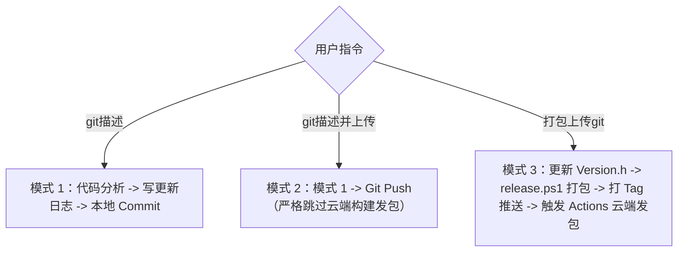

# TrafficMonitorPlugins Git 描述与版本发布工作流

本技能专为 `TrafficMonitorPlugins` 股票行情插件设计，用于智能化提炼代码改动、自动维护「关于插件」页面的更新日志，并管理本地提交、免构建上传与云端 CI/CD 发包全生命周期。

---

## 触发命令与行为规范

本技能根据用户指令的核心意图，严格分为三种执行模式：



---

### 模式一：当用户说【git描述】

**目标**：自动识别当前未提交改动，将关键改动点规范追加到插件更新日志中，然后完成本地 Git Commit。

#### 执行步骤：
1. **分析改动**：
   - 执行 `git status -s` 和 `git diff`（包括未暂存与已暂存改动）；
   - 若工作区完全干净（无任何修改），直接提示用户无需更新；
   - 提取代码实质改动，归纳为 1~4 条规范条目，格式必须符合：
     - `•  【新增】 <功能要点描述>`
     - `•  【优化】 <体验或性能要点描述>`
     - `•  【修复】 <问题修复要点描述>`
2. **同步更新日志**：
   - 定位文件：`Plugins/Stock/ManagerDialog.cpp` 中的 `DrawAboutPage()`；
   - 获取当前系统日期（如 `YYYY-MM-DD`）；
   - 在 `items_MMDD` 和 `LogGroup groups[]` 中：
     - 若今天日期已有条目组，将提炼的新条目智能合并/追加到该组；
     - 若今天为新日期，创建新的 `items_MMDD` 并将其置于 `groups[]` 顶部；
     - 版本标识采用当前 `Version.h` 的版本（如 `YYYY-MM-DD (v2.0.x)`）；
     - 同步检查并必要时增大 `CalcPageContentHeight()` 中的 `PAGE_ABOUT` 虚拟滚动高度，防止文字底部截断；
3. **本地 Git 提交**：
   - 执行 `git add -A` 暂存所有修改（包括代码改动与更新日志）；
   - 按照 Conventional Commits 规范生成提交信息（如 `feat(stock): ...` 或 `fix(stock): ...`）；
   - 执行 `git commit -m "..."`；
4. ⚠️ **严格禁止执行 `git push`**，流程在本地终结，向用户汇报提交详情与更新日志内容。

---

### 模式二：当用户说【git描述并上传】

**目标**：执行更新日志写入并推送到远程仓库，**严格跳过云端构建和发包脚本**。

#### 执行步骤：
1. **执行模式一全部动作**：
   - 自动识别当前改动 -> 提取更新要点 -> 写入 `ManagerDialog.cpp` 更新日志 -> 本地 `git commit`；
2. **推送到远程**：
   - 获取当前分支：`git branch --show-current`；
   - 执行推送：`git push origin <当前分支>`；
3. **免构建保障**：
   - 项目的 GitHub Actions 工作流（`.github/workflows/build-and-release.yml`）仅监听 `tags: ['v*']`，普通分支推送绝对不会触发任何云端构建或 Release 发布；
   - 确认推送成功后，明确告知用户：**代码与更新日志已同步上传，云端编译发包已安全跳过**。

---

### 模式三：当用户说【打包上传git】

**目标**：自增或设定正式版本号，调用发包脚本打包本地产物，打上 Git Tag 推送至 GitHub，同时触发云端 Actions 矩阵构建发布 Release。

#### 执行步骤：
1. **确定目标版本号**：
   - 用户命令中若包含版本号（如 `打包上传git 2.1`），则采用用户指定的版本号；
   - 若用户未显式指定，读取 `Plugins/Stock/Version.h`，将修订号（PATCH）自动 +1（例如从 `2.0.5` -> `2.0.6`）；
2. **运行发包脚本**：
   - 调用发包脚本：
     ```powershell
     powershell -ExecutionPolicy Bypass -File "tools/release.ps1" -Version <目标版本号>
     ```
   - 脚本将自动完成：
     - 覆写 `Plugins/Stock/Version.h` 为全新版本宏；
     - 关闭运行中的测试器释放文件占用；
     - MSBuild 编译 x64 和 x86 Release 动态库；
     - 自动清理历史 zip，打包至 `download/Stock_V<版本>_x64.zip` 与 `download/Stock_V<版本>_x86.zip`；
     - 同步更新 `download/plugin_download.md` 下载列表；
     - 自动提取 `ManagerDialog.cpp` 最新更新日志并生成 `RELEASE_NOTES.md`；
3. **提交发包改动**：
   - `git add -A`
   - `git commit -m "chore(release): bump version to v<目标版本号>"`
4. **创建并推送 Git Tag**：
   - 打上 Git Tag：`git tag v<目标版本号>`
   - 推送代码与 Tag：
     ```powershell
     git push origin <当前分支>
     git push origin v<目标版本号>
     ```
5. **云端 Actions 自动联动**：
   - GitHub Actions 感应到 `v*` 标签，自动创建 GitHub Release，将 `RELEASE_NOTES.md` 作为正文发布，并挂载全架构 zip 安装包供用户一键点击下载；
6. **向用户交付**：汇报新版本号、本地生成的 zip 产物，以及 GitHub Release 下载链接。
