# TrafficMonitor 股票行情插件 (Stock Plugin)

> 本插件是专为 [TrafficMonitor](https://github.com/zhongyang219/TrafficMonitor) 打造的现代化、高颜值暗黑极简看盘与量化分析插件。  
> 既可在任务栏常驻简明盯盘，又支持一键唤起原地沉浸式暗黑悬浮窗与专业级量化行情中心。全面覆盖 **A股 / 港股 / 美股 / ETF基金 / 贵金属黄金 / 行业板块**。

---

## 📸 功能特性全景展示

### 一、悬浮看盘与交互（首页）

任务栏左键点击任意股票即可秒级唤起暗黑半透明悬浮窗，再次点击或点击关闭平滑收起。支持多市场混合自选、实时分时日K图、十字光标与技术指标分析。

| 首页自选盯盘 | 首页持仓收益与ETF穿透 |
| :---: | :---: |
| 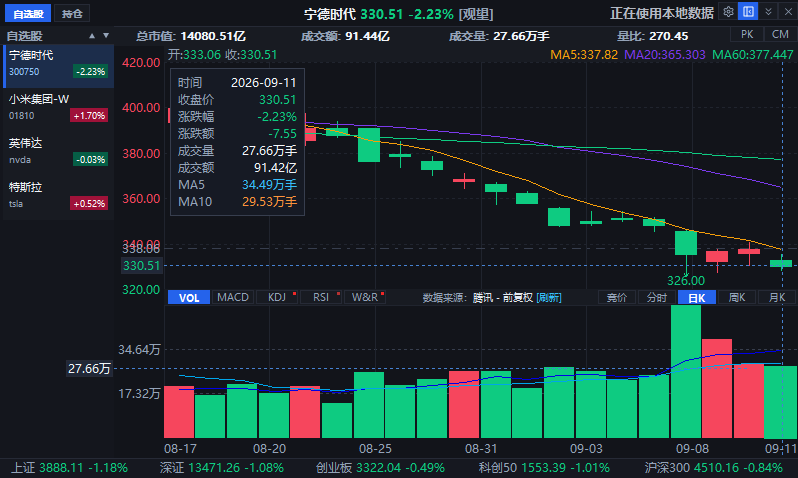 | 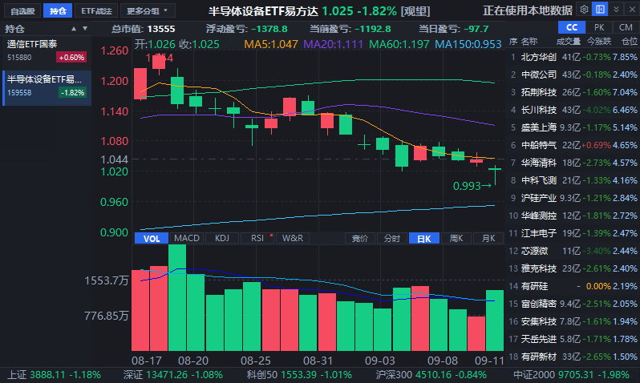 |
| **实时K线与指标**：支持分时、竞价、日K/周K/月K，MA均线（MA5/MA20/MA60等），VOL、MACD、KDJ、RSI、W&R与BOLL布林带 | **持仓监控与ETF透视**：实时核算总市值、浮动盈亏与当日盈亏；ETF持仓一键穿透查看底层权重成分股明细与仓位占比 |

| 实时买卖五档盘口 (PK) | 筹码分布峰与持仓成本 (CM) |
| :---: | :---: |
| 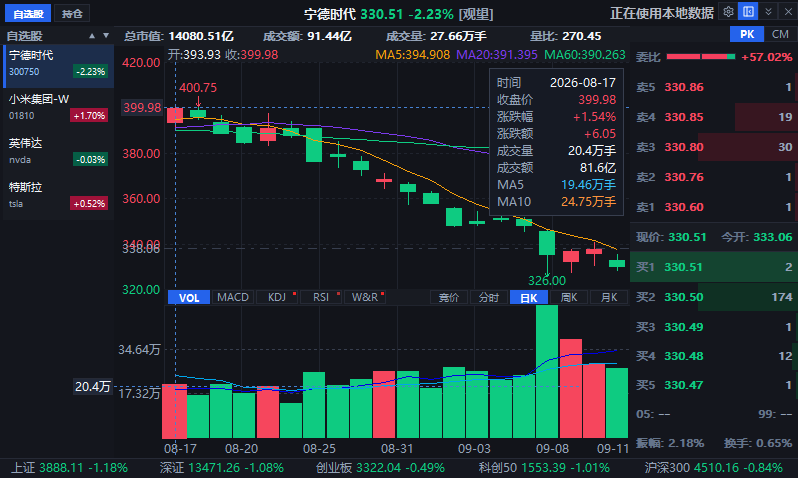 | 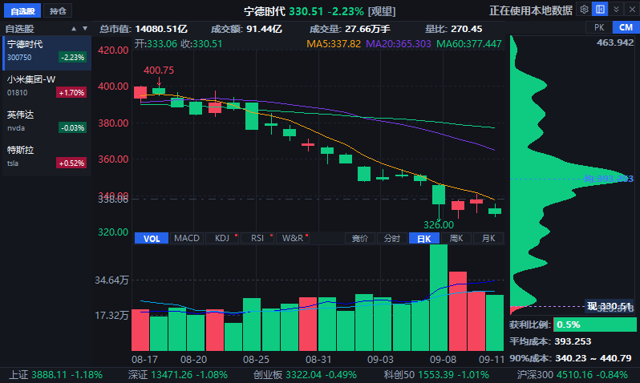 |
| **五档挂单与盘口明细**：实时买卖五档挂单量与价格分布、买卖委比、振幅与换手率统计 | **筹码峰分布图**：筹码获利比例、全市场平均持仓成本、90%成本集中区间，直观洞察支撑与阻力位 |

---

### 二、深度量化行情中心

点击悬浮窗右上角行情看板图标，原地切换至全屏暗黑量化行情中心，汇聚全市场宏观流动性与微观异动。

| 板块资金流向树图 (Treemap) | 主力资金时间走向 (全天折线) |
| :---: | :---: |
| 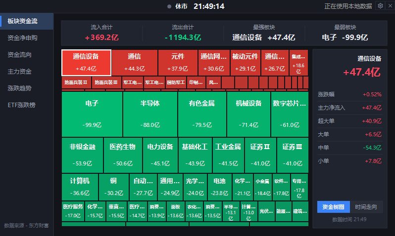 | 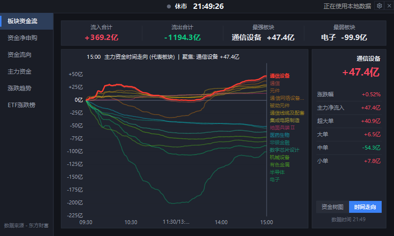 |
| **资金流向热力树图**：按行业资金净流入/流出面积与红绿颜色直观呈现，支持右侧单板块超大单/大单/中单/小单穿透 | **分时资金时间走向**：09:30 - 15:00 全天主力资金累计净流入走势曲线，快速复盘全天资金轮动轨迹 |

| 资金净申购 (ETF申赎动向) | 全市场涨跌趋势分布 (大盘体检) |
| :---: | :---: |
| 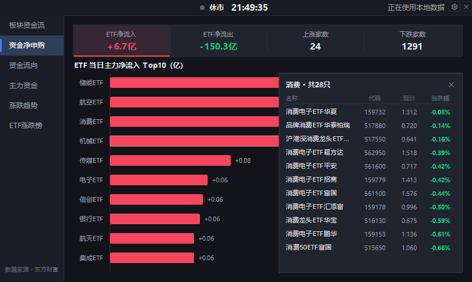 | 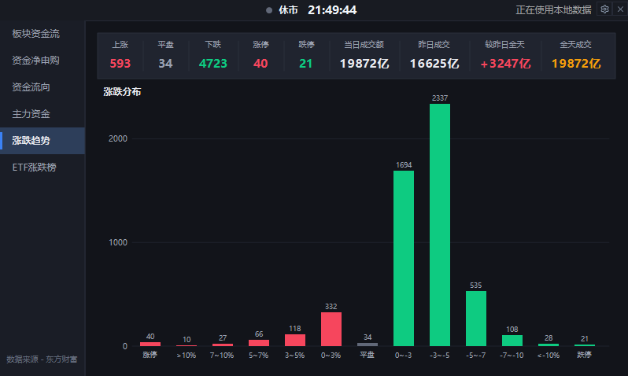 |
| **ETF申赎资金榜**：ETF主力净流入/流出 Top10，支持侧边抽屉一键查阅板块细分ETF列表 | **全市场涨跌分布直方图**：上涨/平盘/下跌/涨停/跌停全览，放量缩量诊断与多空阶梯分布统计 |

| ETF 综合涨跌榜 |
| :---: |
| 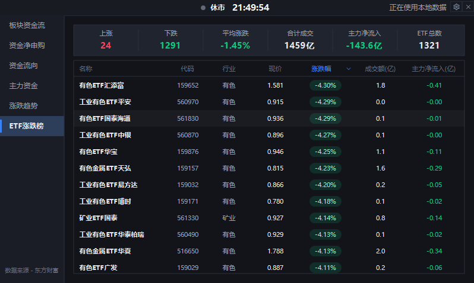 |
| **ETF行情看板**：全市场ETF涨跌幅榜、成交额与主力净流入智能排序 |

---

### 三、内嵌设置中心与数据管理

悬浮窗右上角齿轮图标直达内嵌设置中心，告别传统白边独立弹窗，原地沉浸式管理。

| 基础外观与常规设置 | 分组管理与智能股票联想搜索 |
| :---: | :---: |
| 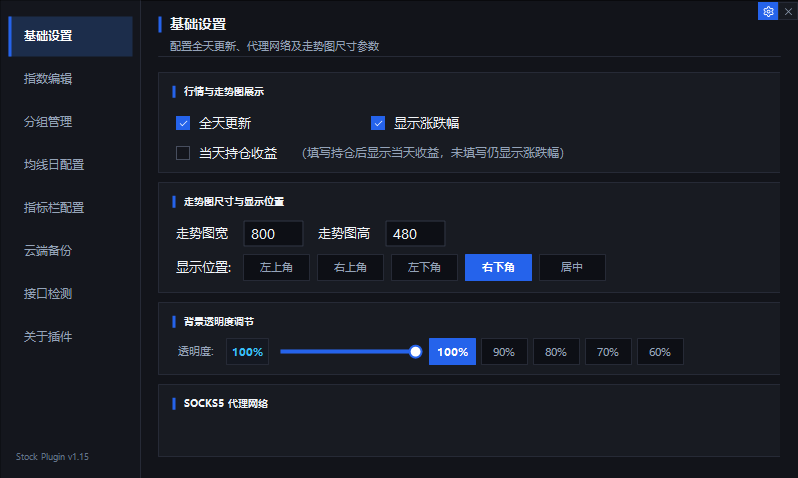 | 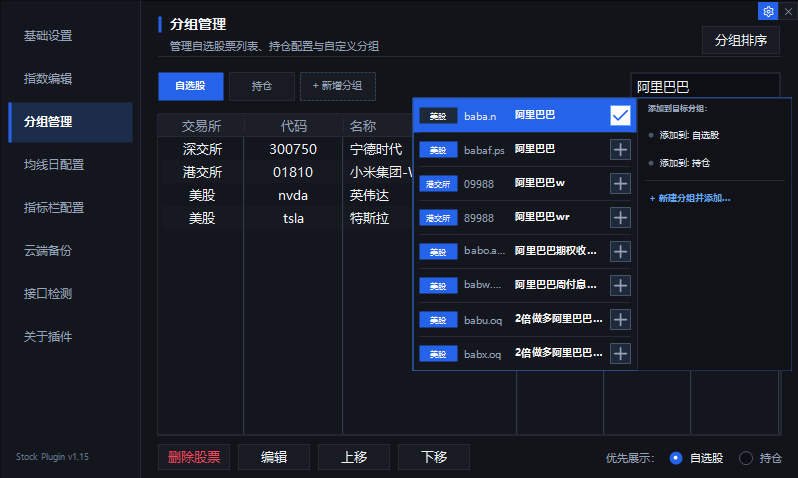 |
| **外观与常规配置**：全天更新、任务栏显示项切换、窗口尺寸与5档停靠位置、背景透明度调节（100%~60%实时无缝调节）、SOCKS5代理配置 | **多分组与拼音联想**：自选股、持仓股及多自定义分组；支持输入拼音/代码跨市场快速联想添加A/港/美股，支持拖拽排序 |

| WebDAV 多端云备份与恢复 | 接口健康与心跳监测 |
| :---: | :---: |
| 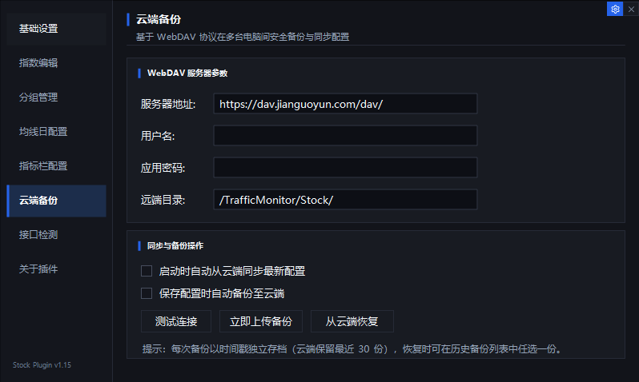 | 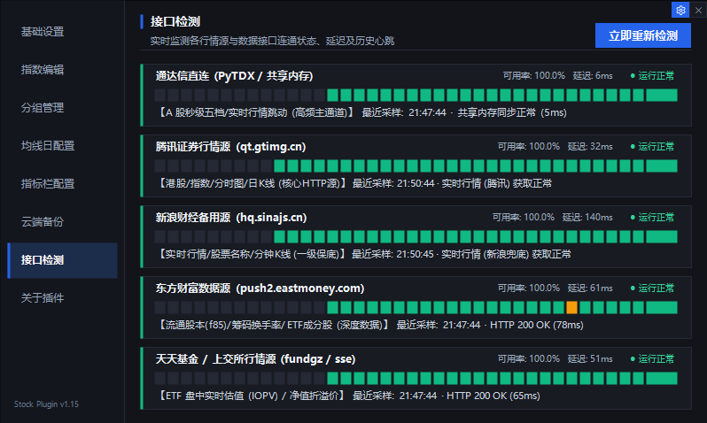 |
| **云端数据同步**：基于标准 WebDAV 协议（支持坚果云、自建 NAS 等），实现多设备自选、持仓配置的一键备份与自动同步 | **全链路接口健康监测**：实时检测腾讯、新浪、东方财富、通达信直连等行情源连通状态、网络延迟与历史心跳色块 |

---

## 🚀 快速开始

### 1. 插件安装

1. 前往 Release 或下载页面获取最新版本的 `Stock.dll`（64位系统请使用 x64 版本）。
2. 将 `Stock.dll` 复制到 TrafficMonitor 安装目录下的 `plugins` 文件夹中：
   ```text
   TrafficMonitor/
   ├── TrafficMonitor.exe
   └── plugins/
       └── Stock.dll
   ```
3. 重启 TrafficMonitor。

### 2. 启用任务栏显示

1. 在 TrafficMonitor 任务栏窗口上点击鼠标右键，选择 **“显示设置”**；
2. 在显示项目中勾选 **“股票”**，点击“确定”即可在任务栏看到实时股票行情。

### 3. 日常快捷操作

- **左键单击任务栏股票项**：快速展开/收起悬浮看盘窗口。
- **右键单击任务栏股票项**：点击 **“刷新股票信息”** 立即强制发起最新行情拉取。
- **悬浮窗右上角按钮**：
  - ⚙️ **齿轮图标**：就地切换至内嵌设置中心（基础设置、分组管理、均线指标、云端备份等）。
  - 📊 **图表图标**：切换至深度行情中心（板块资金流、资金净申购、涨跌分布、ETF榜）。
  - 📌 **展开/收起按钮**：快速切换单股极简视图与左侧股票列表栏。
  - ✕ **关闭按钮**：关闭悬浮窗。

---

## 🛠️ 编译与开发

### 环境要求

- Windows 10 / 11
- Visual Studio 2022 (带 C++ MFC 桌面开发组件)
- Windows SDK 10.0+

### 本地编译

1. 使用 Visual Studio 2022 打开根目录下的 `TrafficMonitorPlugins.sln`。
2. 将构建配置切换为 **Release | x64**。
3. 编译 `utilities` 基础库工程，然后编译 `Stock` 工程。
4. 编译输出产物位于 `bin/x64/Release/Stock.dll`。

---

## 📄 开源许可证

本项目遵循 [MIT License](LICENSE) 协议。
